# Package Diagram - Electronic Device Inventory Management (Back-End)

```mermaid
graph TD
    subgraph server["📦 server"]
        server_js["server.js"]
    end

    subgraph config["📦 config"]
        database_js["database.js"]
    end

    subgraph middleware["📦 middleware"]
        auth_js["auth.js"]
        errorHandler_js["errorHandler.js"]
        roleMiddleware_js["roleMiddleware.js"]
        validators_js["validators.js"]
    end

    subgraph routes["📦 routes"]
        authRoutes["authRoutes.js"]
        deviceRoutes["deviceRoutes.js"]
        categoryRoutes["deviceCategoryRoutes.js"]
        userRoutes["userRoutes.js"]
        maintenanceRoutes["maintenanceRoutes.js"]
        assignmentRoutes["assignmentRoutes.js"]
        warrantyRoutes["warrantyRoutes.js"]
        depreciationRoutes["depreciationRoutes.js"]
        systemRoutes["systemRoutes.js"]
        reportRoutes["reportRoutes.js"]
        locationRoutes["locationRoutes.js"]
    end

    subgraph controllers["📦 controllers"]
        authCtrl["authController.js"]
        deviceCtrl["deviceController.js"]
        categoryCtrl["categoryController.js"]
        userCtrl["userController.js"]
        maintenanceCtrl["maintenanceController.js"]
        assignmentCtrl["assignmentController.js"]
        warrantyCtrl["warrantyController.js"]
        depreciationCtrl["depreciationController.js"]
        systemCtrl["systemController.js"]
        reportCtrl["reportController.js"]
        locationCtrl["locationController.js"]
    end

    subgraph services["📦 services"]
        categorySvc["categoryService.js"]
        depreciationSvc["depreciationService.js"]
        locationSvc["locationService.js"]
        warrantySvc["warrantyService.js"]
        assignmentEmailSvc["assignmentEmailService.js"]
    end

    subgraph models["📦 models"]
        User["User.js"]
        Device["Device.js"]
        DeviceCategory["DeviceCategory.js"]
        Assignment["Assignment.js"]
        Department["Department.js"]
        DepreciationRule["DepreciationRule.js"]
        Location["Location.js"]
        MaintenanceRecord["MaintenanceRecord.js"]
        ReportConfigs["ReportConfigs.js"]
        SystemSettings["SystemSettings.js"]
        Warranty["Warranty.js"]
        WarrantyClaim["WarrantyClaim.js"]
    end

    subgraph utils["📦 utils"]
        helpers["helpers.js"]
        passwordHelper["passwordHelper.js"]
    end

    subgraph scripts["📦 scripts"]
        seedDB["seedDatabase.js"]
        createAdmin["createAdmin.js"]
    end

    %% Dependencies
    server -.->|"<<import>>"| config
    server -.->|"<<import>>"| middleware
    server -.->|"<<import>>"| routes

    routes -.->|"<<import>>"| controllers
    routes -.->|"<<import>>"| middleware

    controllers -.->|"<<import>>"| models
    controllers -.->|"<<import>>"| services
    controllers -.->|"<<import>>"| utils

    services -.->|"<<import>>"| models

    scripts -.->|"<<import>>"| models
    scripts -.->|"<<import>>"| config
    scripts -.->|"<<import>>"| utils

    %% Styling
    style server fill:#4A90D9,stroke:#2C5F8A,color:#fff
    style config fill:#F5A623,stroke:#C47D0E,color:#fff
    style middleware fill:#7B68EE,stroke:#5A4DB0,color:#fff
    style routes fill:#50C878,stroke:#3A9A5C,color:#fff
    style controllers fill:#FF6B6B,stroke:#CC4444,color:#fff
    style services fill:#FFD93D,stroke:#CCB030,color:#333
    style models fill:#6BCB77,stroke:#4A9A56,color:#fff
    style utils fill:#4ECDC4,stroke:#3AA39C,color:#fff
    style scripts fill:#95A5A6,stroke:#7F8C8D,color:#fff
```



## Tóm tắt Dependencies giữa các Package

| Package | Phụ thuộc vào |
|---------|---------------|
| **server** | config, middleware, routes |
| **routes** | controllers, middleware |
| **controllers** | models, services, utils |
| **services** | models |
| **models** | _(chỉ dùng thư viện ngoài: mongoose, bcrypt)_ |
| **middleware** | _(chỉ dùng thư viện ngoài: jsonwebtoken, express-validator)_ |
| **config** | _(chỉ dùng thư viện ngoài: mongoose)_ |
| **utils** | _(chỉ dùng thư viện ngoài: bcrypt)_ |
| **scripts** | models, config, utils |

## Kiến trúc tổng quan

Dự án tuân theo mô hình **MVC (Model-View-Controller)** với kiến trúc phân lớp rõ ràng:

```
server.js (Entry Point)
    ├── config/        → Cấu hình database (MongoDB)
    ├── middleware/     → Xác thực, phân quyền, validation, xử lý lỗi
    ├── routes/        → Định nghĩa API endpoints
    │   └── controllers/   → Xử lý request, điều phối logic
    │       ├── services/      → Business logic & data operations
    │       ├── models/        → Schema MongoDB (Mongoose)
    │       └── utils/         → Hàm tiện ích (hash password, helpers)
    └── scripts/       → Seed data & tạo admin
```

> **Không có circular dependency** - Kiến trúc duy trì luồng phụ thuộc một chiều từ trên xuống dưới.
